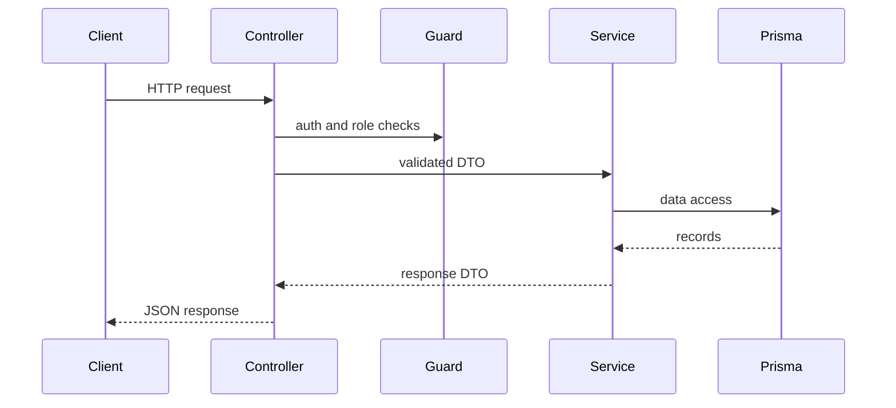
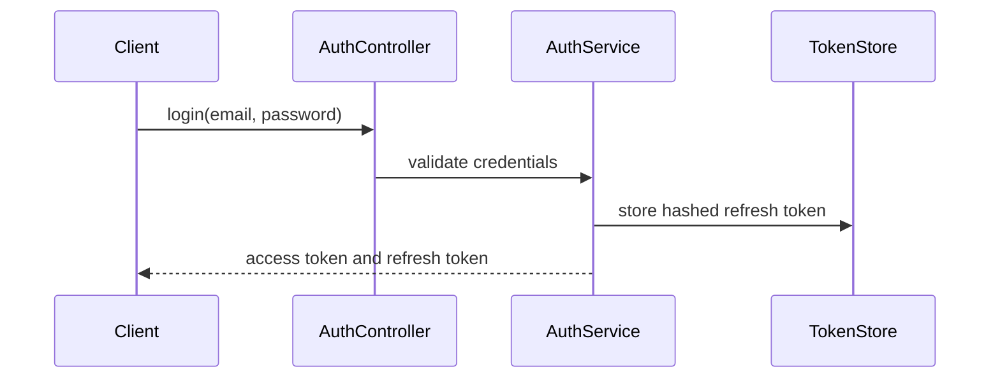
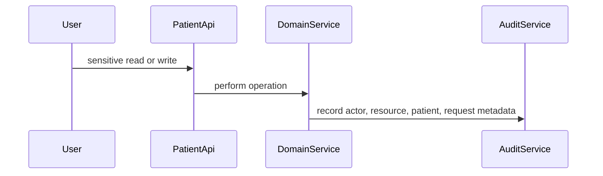
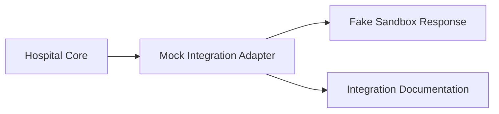

# Architecture

## Modular Monolith

The backend is a NestJS modular monolith. Each module owns its HTTP controller, DTOs, service logic, and persistence interactions. Shared security, request metadata, filters, interceptors, and guards live under `src/common`.

## Main Modules

- Auth and users
- Patients
- Practitioners
- Appointments
- Encounters
- Clinical notes
- Diagnoses
- Lab orders and lab results
- Medication requests
- Audit logs
- FHIR-style read API
- Health and readiness

## Request Flow

## Authentication Flow

## Audit Flow

## Integration Mock Flow

