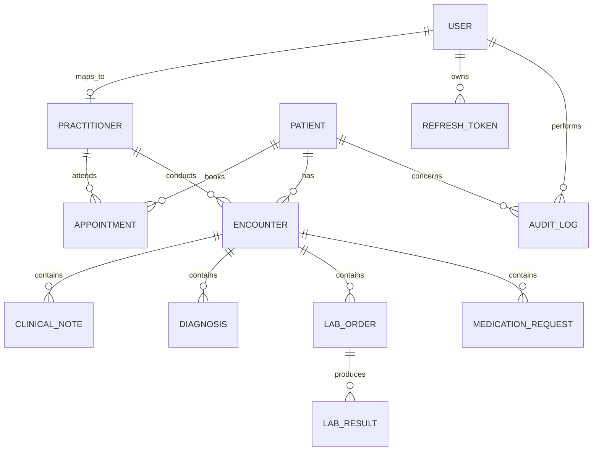

# Database Design

## Entity Descriptions

Initial persistence will be implemented with Prisma and PostgreSQL in Step 2. The planned entities are User, Patient, Practitioner, Appointment, Encounter, ClinicalNote, Diagnosis, LabOrder, LabResult, MedicationRequest, AuditLog, and RefreshToken.

## Relationships

- User may be linked to Practitioner.
- Patient has appointments, encounters, lab orders, lab results, medication requests, and audit log references.
- Practitioner participates in appointments and encounters.
- Encounter owns clinical notes, diagnoses, lab orders, and medication requests.
- LabOrder owns lab results.
- RefreshToken belongs to User.

## ER Diagram

## Indexing Strategy

Planned indexes include unique user email, unique medical record number, indexed national ID hash or masked field, appointment patient/practitioner/start time, encounter patient/practitioner, lab status and patient references, and audit actor/patient/resource/created time fields.

## Soft Delete Strategy

Patient records use `deletedAt` for soft deletion. Normal API flows do not physically delete patient records.

## Audit Log Design

Audit logs capture actor, role, action, resource type, resource ID, optional patient ID, request ID, IP address, user agent, success flag, metadata, and timestamp.
